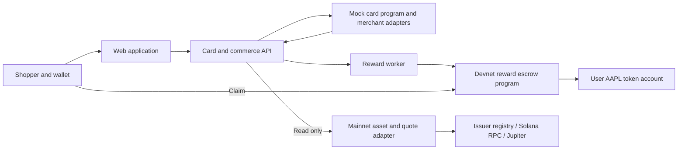

# Consume to Own — Technical Design

Status: Target architecture with an implemented frontend and a deployed, verified Devnet Anchor reward program. See [Devnet deployment](06-devnet-deployment.md) for current chain evidence. Phantom and OKX wallet connections are implemented; SQLite, transaction signing, and swaps remain future work. See [Wallet connection](08-wallet-connection.md).

Date: September 12, 2026

September 13 update: [The everyday collection](07-collection-refresh.md) supersedes the original $800 phone / $50 reward fixture below. The current frontend uses iPhone Duo at $1,999, a $100 reward, and 3,000 starting sample USDC. Other brands are browsable concepts. Historical Devnet smoke-test amounts remain unchanged.

Dependency: [Product requirements](01-product-requirements.md)

## 1. Architecture decision

Build a branded Own Card application with a small Solana reward escrow program. Simulate card activation, USDC top-up, purchasing, payment, and a program-funded promotional reward. Execute reward funding and claiming on Devnet. Keep real AAPLx discovery and pricing in a separate mainnet reference panel.

The program verifies who can fund a reward, its recipient, asset, amount, and one-time payout. It cannot independently verify a card purchase, promotional reward eligibility, refund, or stock backing. Those facts remain with the platform and the existing asset issuer.



## 2. Demo modes and proof boundaries

| Capability | Core demo | Mainnet reference | Optional future live delivery |
| --- | --- | --- | --- |
| Commerce | Simulated | None | Still separate from live commerce integration |
| Payment | Own Card simulated USDC balance / USD merchant purchase | None | Separate production integration |
| Asset | AAPL on Devnet | Real AAPLx metadata and quote | Verified real AAPLx |
| Funding | Seeded test-token treasury | None | Purchased or pre-funded real inventory |
| Claim | Real Devnet instruction | None | Requires independently validated deployment |
| Economic claim | No monetary value | Indicative route only | Actual amount delivered |

Do not pass a mainnet mint into a Devnet transaction. Do not label an inventory transfer as a purchase executed through Jupiter. Do not silently fall back from mainnet data to fixtures; return a source and mode in every response.

## 3. Proposed stack and structure

- Next.js, React, and TypeScript for the web application and server routes.
- Custom CSS for styling; one Solana wallet integration supporting Phantom and Solflare.
- Rust and Anchor for the reward program.
- A consistent compatible Solana TypeScript client stack and SPL token helpers, selected and version-pinned during scaffolding.
- SQLite for the demo backend, with a simple sequential reward action. Use a persistent disk and a single application instance. The frontend-first phase uses browser-local state until this backend is connected.
- A configured Devnet RPC endpoint and platform fee payer funded with test SOL.

```text
app/                         Card overview, offers, checkout, receipts, portfolio
app/api/                     Server endpoints
components/                  Shared product components
lib/domain/                  Money, card ledger, offers, order state, brand mappings
lib/adapters/                Mock card program, commerce, prices, asset registry, quotes
lib/solana/                  Network config and program client
server/                      Persistence, sessions, reward worker
programs/reward-vault/        Anchor program
tests/                       Program and workflow checks
scripts/                     Local setup, Devnet deployment, fixture seeding
docs/                        Requirements and architecture
```

Keep private RPC credentials, API keys, operator keys, and payment event secrets server-side. No private key is bundled in the browser. A browser wallet signature authenticates the user; it does not authorize the operator to spend user funds.

## 4. Canonical fixture and money representation

```text
Product: Demo Smartphone — Apple
Currency: USD
Card: Own Card (simulated)
Starting balance: 1000000000 simulated USDC atomic units
Retail payment / merchant settlement: 80000 USD cents
Mock FX: 1 USDC = 1 USD; zero conversion fee
Card debit: 800000000 simulated USDC atomic units
Ending balance: 200000000 simulated USDC atomic units
Program promotional reward budget: 5000 USD cents (separate source)
Illustrative AAPL unit price: 20000 cents
Demo mint decimals: 6
Reward quantity: 250000 atomic units = 0.25 AAPL
```

The $200 price is a fixture, not the current Apple or AAPLx price. Real quotes return actual atomic output amounts; they must not reuse this fixture formula.

Use integer cents for fiat, integer atomic units for tokens, and decimal strings in JSON where values may exceed JavaScript's safe integer range. Round token conversion down, record any remainder, and never silently spend above the reward budget. Store USD and USDC with separate currency identifiers; conversion is an explicit transaction in a live system.

## 5. Off-chain model and state transitions

### Records

- `CardAccount`: user, masked demo identifier, activation state, simulated USDC balance.
- `CardLedgerEntry`: unique operation ID, card account, top-up/debit/refund type, amount, order reference. No on-chain USDC is moved.
- `Offer`: product, merchant, brand, company, purchase cents, promotional reward cents, campaign budget, terms version, expiry.
- `Order`: random ID, immutable offer snapshot, card account, investment-reward consent, recipient wallet, consent timestamp, payment status, fulfillment status, reward status.
- `PaymentEvent`: unique provider event ID, order ID, amount, currency, event type, verified source, processing result.
- `Reward`: unique order reference, network, mint, recipient, budget cents, atomic quantity, price source/time, program account, funding/claim signatures.
- `RewardAction`: unique order reference, current step, last error, and submitted chain signature for manual retry.
- `Asset`: company mapping, issuer URL, network, verified mint, token program, decimals, validation timestamp, support status.

Keep personal shopping information and card data off-chain. The chain receives a hash of an unguessable order reference, not a raw customer ID or public receipt URL. Even hashes and amounts can correlate activity; this is not a private-payment design.

### State machines

```text
Payment: created -> authorized -> captured -> settled
                    |              |
                    failed         refunded (before release)

Card: inactive -> active
      top-up / purchase / refund updates the simulated balance

Reward: pending -> ready -> funding -> claimable -> claimed
           |         |        |
           cancelled cancelled retry / reconcile
```

`ready` requires a settled Own Card purchase, campaign eligibility, and a released simulated reward. `claimable` requires a confirmed on-chain allocation with matching fields. Token quantity is fixed at allocation time; later price changes do not change the entitlement.

For the demo, execute payment simulation, reward calculation, and allocation sequentially. Persist each step and show retryable failures. Use unique operation IDs to avoid duplicate simulated debits and allocations. Prevent refunds while funding is in flight; after release, report that refunds are outside this demo flow. Do not implement a distributed transaction, transactional outbox, or production job infrastructure.

Card top-up credits the simulated ledger only. Purchase debits the card balance once; a pre-release refund restores it once. The separate campaign budget funds the $50 reward and is not deducted from the user's remaining card balance. Never store card mock funds as wallet token balances.

On an RPC timeout, inspect signature status and the reward account before retrying. For an expired blockhash, rebuild only after reconciling prior execution. A new transaction signature is not evidence that a new entitlement should exist.

## 6. Contract specification

Program name: `reward_vault`.

Use per-reward escrow so funding and obligation creation are atomic. This avoids a shared vault whose balance can be over-promised across many orders.

### Accounts

| Account | Seeds / identity | Fields and constraints |
| --- | --- | --- |
| Config PDA | `config` | Admin, operator, approved demo mint, token program, paused flag, version |
| Reward PDA | `reward`, config public key, 32-byte order hash | Recipient, mint, amount, order hash, status, bump |
| Escrow ATA | ATA for Reward PDA and approved mint | Reward PDA is token authority |
| Recipient ATA | ATA for recorded recipient and mint | Destination fixed by the program |

The core program supports the standard SPL Token Program and one configured Devnet mint. It does not claim arbitrary Token-2022 compatibility. Do not expose a generic arbitrary-token drain or swap instruction.

### Instructions

**`initialize_config(operator, mint)`**

One-time setup by the deployment authority. Initialization must verify that authority against the deployed program's upgrade-authority account, or use a pinned initializer established at build time; an arbitrary first caller must not be able to seize configuration. Verify mint owner and token program. Record admin and operator.

**`allocate_reward(order_hash, recipient, amount)`**

Operator signature required; program must be unpaused; amount must be positive. Create the unique Reward PDA and its escrow ATA. Transfer the exact amount from the operator's funded source account using checked token transfer. Persist status `Funded` only as part of the same successful transaction. Reject existing Reward PDAs and mismatched mint, token program, source authority, or escrow owner. The operator pays account rent.

**`claim_reward()`**

Recorded recipient signs. Require `Funded`, validate all account relationships, and transfer the stored amount from escrow to the recipient ATA with PDA signing. Create the ATA if necessary, with an explicit fee payer. Set status `Claimed` atomically with the transfer and emit an event. A failed transfer rolls back the state update. Existing funded claims remain available when new allocations are paused.

**`set_paused(bool)` / `set_operator(pubkey)`**

Admin-only controls for allocation operations. No admin instruction can rewrite a funded recipient, amount, or mint, withdraw its escrow, or reset a claimed reward.

Keep the Reward PDA after payout as the durable replay-prevention record. Account closure/reclaim is excluded from the MVP. A program upgrade authority can change the code: disclose that trust explicitly; this demo is not immutable infrastructure.

### Events and invariants

Emit `RewardAllocated(order_hash, recipient, mint, amount)` and `RewardClaimed(order_hash, recipient, mint, amount)` without commerce PII.

Required invariants:

1. A given order hash can allocate only once in this program/configuration.
2. Every newly funded entitlement is covered by an atomic escrow deposit.
3. Only the recorded recipient can claim, only to the validated recipient account.
4. A successful claim pays the recorded amount exactly once.
5. An unauthorized caller cannot fund, pause, rotate authority, or initialize config.

The contract does not prove the reward is worth $50, that a phone shipped, or that an operator's allocation is commercially justified. Database reconciliation links those assertions to the chain receipt.

## 7. AAPLx integration path

The issuer identifies AAPLx as a tracker certificate issued on Solana and other supported networks. Use its official product documentation as the starting point for asset identity. [Apple xStock](https://assets.backed.fi/products/apple-xstock).

Implementation steps:

1. Retrieve the official Solana mint from the issuer's linked registry/explorer information and record provenance. Never select a mint by ticker search alone.
2. Fetch the mainnet mint account through RPC; verify owner program, decimals, authorities, and extensions. Pin the validated address in the server asset registry.
3. Check required transfer behavior. Token extensions may alter transfers or add restrictions; unsupported behavior blocks live delivery. [Solana token extensions](https://solana.com/docs/tokens/extensions).
4. Request an indicative USDC-to-AAPLx route for the equivalent reward budget through Jupiter's current Swap API V2 adapter. Validate the response's input/output mints, amounts, price impact, minimum output, and timestamp. Current docs describe `/order` for the managed flow and `/build` for custom instructions. [Jupiter V2](https://developers.jup.ag/docs/swap/order-and-execute), [Build API](https://developers.jup.ag/docs/api-reference/swap/build).
5. Return `live`, `cached`, or `unavailable` plus the retrieval time. Treat a cached quote as expired after 30 seconds for this UI; even a fresh quote is indicative and requires a new execution request before any future trade.

This design review verified the existence of the product and the API documentation. It has **not** verified a canonical mint account, live $50 route, liquidity, token extension compatibility, or executable transaction. These become explicit implementation checks, not assumed completed integrations.

The reference panel can ship with an honest unavailable state if external access fails. A timestamped fixture may support a presentation but must say “Recorded example,” never “Live quote.”

### Optional real-token extension

Use a small platform-funded treasury, an eligible recipient, and a separately reviewed mainnet configuration. Acquire AAPLx off-chain through an execution adapter or pre-fund inventory, then allocate tokens only after acquisition confirmation. Acquisition and delivery are separate operations; a purchase followed by a delivery failure leaves inventory to reconcile.

Do not put Jupiter CPI in the first contract. A standard SPL demo does not establish support for the real mint: extend and test the program for the verified token program and extensions before any mainnet allocation. Simulate the exact funding and claim transactions and inspect resulting balances. Distribution conditions remain applicable. [xStocks partner requirements](https://xstocks.com/partner).

## 8. API boundary

| Endpoint | Responsibility |
| --- | --- |
| `GET /api/card` | Simulated Own Card state and balance |
| `POST /api/demo/card/activate` | Activate an owned demo card |
| `POST /api/demo/card/top-up` | Add simulated funds with an idempotency key |
| `GET /api/catalog` | Server-authoritative offers and brand mappings |
| `POST /api/auth/challenge` | Single-use wallet login challenge with domain and expiry |
| `POST /api/auth/verify` | Verify wallet signature and create session |
| `POST /api/orders` | Snapshot offer, card, reward consent, and wallet; idempotency key required |
| `POST /api/demo/payments` | Check card status/balance and simulate debit or failure for an owned order |
| `POST /api/demo/settlements` | Authenticated operator action; settle and close mock refund window |
| `POST /api/demo/refunds` | Apply allowed pre-release refund atomically |
| `GET /api/orders/:id` | Authorized order and reconciled reward status |
| `POST /api/rewards/:id/claim-transaction` | Build unsigned recipient-bound Devnet transaction |
| `GET /api/portfolio` | Wallet quantities plus order-attributed rewards |
| `GET /api/assets/apple/reference` | Mainnet metadata and quote with explicit provenance |

Never trust a client success callback as proof of payment or chain confirmation. Protect operator actions, validate sessions and order ownership, and disable demo mutation routes outside the demo environment. Mock webhook events must have a server-controlled authenticated origin.

## 9. Implementation order

1. **Product shell:** Own Card overview, activation, top-up, Apple offer, checkout, receipt, and portfolio.
2. **Card and commerce state:** Simulated balances, ledger entries, promotional budget, orders, wallet sessions, and sequential mock actions.
3. **Contract:** Implement and validate local allocation/claim flow, then deploy to Devnet and seed AAPL inventory.
4. **Connect the journey:** Settlement worker, escrow funding, claim transaction, chain confirmation, and portfolio reconciliation.
5. **Real-asset reference:** Verify AAPLx identity and inspect a current quote; preserve explicit unavailable behavior.
6. **Presentation polish:** Responsive visual review and a repeatable three-minute walkthrough.

Do not expand to additional merchants or a live-money flow until the single Apple journey passes its checks.

## 10. Validation and demo script

### Required checks

- Contract: authorized initialization; unauthorized allocation rejected; insufficient funding creates no entitlement; duplicate order rejected; wrong recipient/mint/destination rejected; repeat claim rejected; transfer failure preserves claimability; pause blocks funding but permits existing claims.
- Workflow: duplicate payment events; insufficient card balance; repeated top-up; failed payment; pre-release refund; refund blocked during funding; RPC timeout after a successful transaction; wallet change; missing quote; stale pricing.
- End to end: buy, settle, allocate, claim, reload, and verify the actual destination token balance and explorer transaction. Portfolio refresh must not rely solely on optimistic UI.
- UI: desktop and narrow mobile checkout, keyboard navigation, clear network labels, rejected wallet prompt recovery.

### Three-minute walkthrough

1. Activate Own Card and add 1,000 simulated USDC; open the Apple phone offer.
2. Pay $800 with Own Card; show the remaining 200 USDC and a separate $50 pending promotional investment reward.
3. Advance simulated settlement and show the real Devnet allocation receipt.
4. Claim 0.25 AAPL at the disclosed $200 fixture price; open the Devnet transfer.
5. Open the portfolio and the separate real AAPLx reference panel.
6. Explain the boundary: simulated Own Card program, real testnet enforcement, existing issuer asset as the future reward rail.

If Devnet is unavailable, present a labeled recorded walkthrough; do not fabricate a successful transaction or explorer signature.

## 11. Definition of completion

Deliver a running application, source code, program tests, deployment/seeding instructions, verified Devnet program and mint addresses, a reproducible order-to-claim walkthrough, and an evidence table distinguishing implemented, simulated, externally verified, and still-unverified features.

This document specifies that future work. It does not claim those artifacts already exist.
